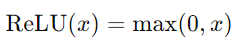
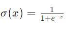

## 활성화 함수의 종류

### ReLU(Rectified Linear Unit)
* 인공신경망에서 널리 사용되는 활성화 함수
* 주로 딥러닝 모델에서 비선형성을 도입하기 위해 사용
* 입력 값이 0보다 크면 그 값을 그대로 반환
* 0 이하의 값에 대해서는 0을 반환

**주요 특징**
1. 비선형성 : ReLU는 비선형성을 제공하여 모델이 복잡한 패턴을 학습할 수 있게 도와준다. 하지만 ReLU 자체는 선형 구간이기 때문에 계산이 간단하다.
2. 기울기 소실 문제 완화 : 다른 활성화 함수(예: 시그모이드 또는 하이퍼볼릭 탄젠트)와 비교했을 때, ReLU는 양의 영역에서 기울기가 1로 일정하다. 이로 인해 깊은 네트워크에서 기울기 소실 문제를 어느 정도 완화해 준다.
3. 계산 효율성 : ReLU는 계산이 간단하여 CPU 및 GPU에서 빠르게 처리할 수 있다. 이는 대규모 데이터셋과 복잡한 모델을 학습할 때 큰 장점이 된다.

**단점**
1. 죽은 ReLU 문제 : 입력 값이 0 이하인 경우 기울기가 0이 되므로, 네트워크의 일부 뉴런이 학습 중에 '죽어'버릴 수 있다. 이는 뉴런이 영구적으로 비활성화되는 결과를 초래할 수 있다.
2. 불안정한 출력 : 입력 값이 극단적으로 클 경우 출력 값도 극단적으로 커질 수 있어, 이러한 특성이 학습의 안정성에 영향을 줄 수 있다.

**변형**
ReLU의 단점을 해결하기 위해 여러 변형이 개발되었습니다. 대표적인 예로는:
- Leaky ReLU : 입력이 0 이하일 때 아주 작은 기울기를 가집니다.
- Parametric ReLU (PReLU) : Leaky ReLU의 일반화 버전으로, α를 학습 가능한 파라미터로 설정한다.
- Exponential Linear Unit (ELU) : ReLU의 특성을 유지하면서, 0 이하일 때 지수 함수로 부드럽게 감소한다.

이러한 변형들을 통해 ReLU의 단점을 보완하고, 보다 안정적인 학습을 가능하게 한다.

### Sigmoid
시그모이드(Sigmoid) 함수는 인공신경망에서 널리 사용되는 활성화 함수 중 하나로, 출력값을 0과 1 사이로 압축하는 특징을 가지고 있다. 주로 이진 분류 문제에서 출력층의 활성화 함수로 사용되며, 확률적 해석을 가능하게 한다.

**수학적 정의**
시그모이드 함수는 다음과 같이 정의된다.

여기서 e는 자연 상수(약 2.718)이다.

**그래프와 특징**
- S자형 곡선 : 시그모이드 함수의 그래프는 S자 형태로, 입력 값이 증가함에 따라 출력 값이 0에서 1로 부드럽게 변화한다.
- 출력 범위 : 출력 값은 항상 0과 1 사이다. 이는 확률을 나타내는 데 유용하다.
- 기울기 : 시그모이드 함수의 기울기는 입력 값이 0일 때 최대(0.25)이며, 입력 값이 극단적으로 크거나 작을 경우 기울기는 0에 가까워진다. 이로 인해 기울기 소실 문제가 발생할 수 있다.

**장점**
1. 확률적 해석 : 출력값을 0과 1 사이로 변환하므로, 이진 분류 문제에서 클래스 확률을 표현하는 데 유용하다.
2. 비선형성 : 시그모이드 함수는 비선형성을 제공하여 신경망이 복잡한 패턴을 학습할 수 있게 한다.

**단점**
1. 기울기 소실 문제: 입력 값이 극단적으로 크거나 작을 경우 기울기가 거의 0에 가까워져, 역전파 시 기울기가 소실되는 문제가 발생한다. 이는 깊은 네트워크에서 학습이 느려지거나 멈추는 원인이 된다.

2. 출력 중심 문제: 출력이 항상 0과 1 사이에 있기 때문에, 출력 값의 평균이 0이 아니게 되어 학습에 부정적인 영향을 줄 수 있다.

3. 계산 비용: 지수 함수의 계산이 필요하므로, ReLU와 같은 다른 활성화 함수에 비해 계산 비용이 상대적으로 높다.

**사용 예**
- 출력층 : 이진 분류 문제의 출력층에서 확률을 예측하는 데 주로 사용된다.
- 간층 : 초기 신경망에서는 중간층의 활성화 함수로 사용되었으나, 현재는 다른 활성화 함수(예: ReLU)가 더 많이 사용된다.
시그모이드 함수는 역사적으로 중요한 역할을 했지만, 깊은 신경망에서는 기울기 소실 문제로 인해 다른 활성화 함수들이 선호되는 경향이 있다.