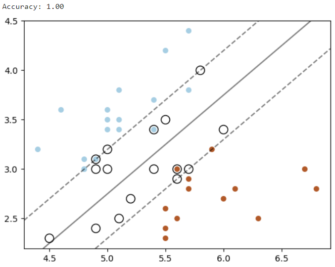

### 오늘의 주제 : SVM

&ensp;SVM(Support Vector Machine)은 지도 학습 알고리즘 중 하나로, 주로 분류(classification)와 회귀(regression) 문제에 사용된다. 특히, 이진 분류 문제에서 가장 널리 쓰인다. SVM의 핵심 개념은 `결정 경계(decision boundary)`를 찾아 데이터를 분류하는 것이다.

#### 개념
&ensp;SVM은 두 클래스 간의 가장 `최대 마진(maximum margin)`을 확보하는 결정 경계를 찾는다. 이 경계는 두 클래스 사이에 놓인 직선(또는 평면, 초평면)이며, 이 직선에서 각 클래스의 데이터 포인트와의 거리가 최대가 되도록 한다.
&ensp;SVM에서는 데이터를 구분하는 선 또는 면을 `초평면(hyperplane)`이라 부른다. 2차원에서는 선, 3차원에서는 평면, n차원에서는 초평면이 된다.
&ensp;`마진(margin)`은 초평면에서 가장 가까운 데이터 포인트까지의 거리를 의미한다. SVM은 이 마진을 최대화하는 초평면을 찾는 것이 목표다. 마진이 클수록 모델이 일반화 성능이 높다고 할 수 있다.
&ensp;`서포트 벡터(support vector)`는 초평면에 가장 가까운 데이터 포인트들로, 마진의 경계를 형성한다. SVM은 이 서포트 벡터들에 의해 초평면이 결정되며, 나머지 데이터 포인트들은 결정 경계에 영향을 주지 않는다.
&ensp;SVM은 선형 분리가 불가능한 경우, 데이터를 고차원 공간으로 변환하여 선형 분리가 가능하게 만들 수 있다. 이를 커널 트릭(kernel trick)이라고 하며, 대표적인 커널 함수로는 다항식 커널(Polynomial kernel), RBF(Radial Basis Function) 커널 등이 있다.

#### 장단점

&ensp;먼저 장점이라면, 고차원의 데이터를 효과적으로 처리할 수 있다. 커널 트릭을 사용한다면 선형적으로 분리할 수 없는 데이터도 분류도 가능하다. 게다가 과적합을 피하기 위해 최대 마진을 사용하여 일반화 성능이 좋다.
&ensp;반면 단점으로는, 큰 데이터셋에서는 학습 시간이 오래 걸릴 수 있다. 또한 다중 클래스 분류 문제에서 직접적으로는 사용하기 어렵다(일대다(One-vs-Rest) 방법 등으로 해결).그리고 하이퍼파라미터(C, 커널 유형 등) 선택에 민감하다는 단점도 있다.

#### 파이썬으로 SVM 구현 (사이킷런 사용)
&ensp;다음은 사이킷런(scikit-learn)을 사용한 간단한 SVM 구현 예제다. 이 예제는 이진 분류 문제를 다루며 **ChatGPT**가 멋지게 코드로 구현해 주었다.
```python
# 필요한 라이브러리 임포트
from sklearn import datasets
from sklearn.model_selection import train_test_split
from sklearn.svm import SVC
from sklearn.metrics import accuracy_score
import matplotlib.pyplot as plt
import numpy as np

# 데이터셋 로드 (붓꽃 데이터셋 사용)
iris = datasets.load_iris()
X = iris.data[:, :2]  # 특성(feature) 2개만 사용 (2D로 시각화하기 위해)
y = iris.target

# 이진 분류 문제로 만들기 (클래스 0, 1만 사용)
X = X[y != 2]
y = y[y != 2]

# 훈련 세트와 테스트 세트로 나누기
X_train, X_test, y_train, y_test = train_test_split(X, y, test_size=0.3, random_state=42)

# SVM 모델 생성 (선형 커널 사용)
model = SVC(kernel='linear')

# 모델 훈련
model.fit(X_train, y_train)

# 예측
y_pred = model.predict(X_test)

# 정확도 출력
accuracy = accuracy_score(y_test, y_pred)
print(f"Accuracy: {accuracy:.2f}")

# 결정 경계 시각화
def plot_svm_boundary(model, X, y):
    # 서포트 벡터, 결정 경계 그리기
    plt.scatter(X[:, 0], X[:, 1], c=y, s=30, cmap=plt.cm.Paired)
    
    ax = plt.gca()
    xlim = ax.get_xlim()
    ylim = ax.get_ylim()

    # 그리드 포인트 생성
    xx = np.linspace(xlim[0], xlim[1], 50)
    yy = np.linspace(ylim[0], ylim[1], 50)
    YY, XX = np.meshgrid(yy, xx)
    xy = np.vstack([XX.ravel(), YY.ravel()]).T
    Z = model.decision_function(xy).reshape(XX.shape)

    # 결정 경계 그리기
    ax.contour(XX, YY, Z, colors='k', levels=[-1, 0, 1], alpha=0.5,
               linestyles=['--', '-', '--'])

    # 서포트 벡터 그리기
    ax.scatter(model.support_vectors_[:, 0], model.support_vectors_[:, 1], s=100,
               linewidth=1, facecolors='none', edgecolors='k')
    plt.show()

# 결정 경계 시각화
plot_svm_boundary(model, X_test, y_test)
```

##### 결과 화면

놀랍게도 정확도가 100%로 나왔다.