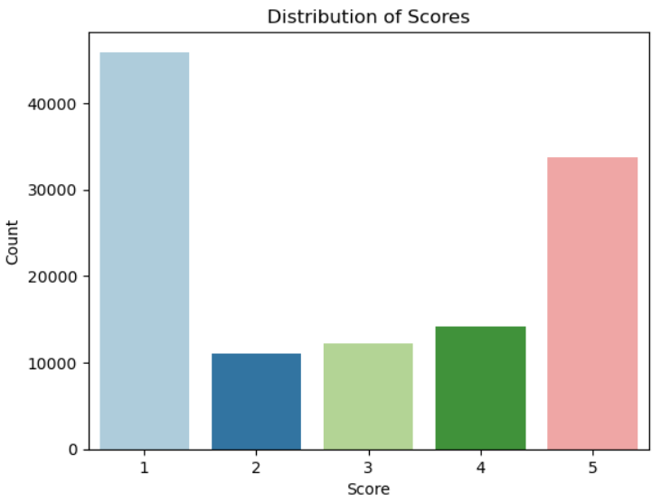

어제 이어서 필수 과제와 도전 과제를 풀어보았다.   

4. **Logistic Regression, Random Forest, XGBoost 모델 학습시키기**   
4-1. 모델 학습 준비   
이제 모델을 학습시키기 위한 데이터를 준비하겠습니다.   
학습에 필요한 feature은 'survived', 'pclass', 'sex', 'age', 'sibsp', 'parch', 'fare', 'embarked', ‘family_size’ 입니다.   
feature과 target을 분리해주시고 그 다음 데이터 스케일링을 진행해주세요.   
```python
titanic = titanic[['survived', 'pclass', 'sex', 'age', 'sibsp', 'parch', 'fare', 'embarked', 'family_size']]
X = titanic.drop('survived', axis=1) # feature
y = titanic['survived'] # target
```   
이제 Logistic Regression, Random Forest, XGBoost를 통해서 생존자를 예측하는 모델을 학습하세요.   
학습이 끝난 뒤 Logistic Regression과 Random Forest는 모델 accuracy를 통해, XGBoost는 mean squared error를 통해 test data를 예측하세요.   
4-2. Logistic Regression   
```python
from sklearn.model_selection import train_test_split
from sklearn.preprocessing import StandardScaler
from sklearn.linear_model import LogisticRegression
from sklearn.metrics import accuracy_score, classification_report

# 데이터 분할
X_train, X_test, y_train, y_test = train_test_split(X, y, test_size=0.2, random_state=42)

# 데이터 스케일링
scaler = StandardScaler()
X_train = scaler.fit_transform(X_train)
X_test = scaler.transform(X_test)

# 모델 생성 및 학습
model = LogisticRegression()
model.fit(X_train, y_train)

# 예측
y_pred = model.predict(X_test)

# 평가
print(f"Accuracy: {accuracy_score(y_test, y_pred)}")
print(f"Classification Report:\n{classification_report(y_test, y_pred)}")
```
**결과 화면**      
```
Accuracy: 0.8044692737430168
Classification Report:
              precision    recall  f1-score   support

           0       0.82      0.86      0.84       105
           1       0.78      0.73      0.76        74

    accuracy                           0.80       179
   macro avg       0.80      0.79      0.80       179
weighted avg       0.80      0.80      0.80       179
```   
4-3. Random Forest   
```python
from sklearn.tree import DecisionTreeClassifier

# 데이터 분할
X_train, X_test, y_train, y_test = train_test_split(X, y, test_size=0.2, random_state=42)

# 데이터 스케일링
scaler = StandardScaler()
X_train = scaler.fit_transform(X_train)
X_test = scaler.transform(X_test)

# 모델 생성 및 학습
model = DecisionTreeClassifier(random_state=42)
model.fit(X_train, y_train)

# 예측
y_pred = model.predict(X_test)

# 평가
print(f"Accuracy: {accuracy_score(y_test, y_pred)}")
print(f"Classification Report:\n{classification_report(y_test, y_pred)}")
```   
**결과 화면**   
```
Accuracy: 0.770949720670391
Classification Report:
              precision    recall  f1-score   support

           0       0.83      0.76      0.80       105
           1       0.70      0.78      0.74        74

    accuracy                           0.77       179
   macro avg       0.77      0.77      0.77       179
weighted avg       0.78      0.77      0.77       179
```   
4-4. XGBoost   
```python
import xgboost as xgb
from sklearn.metrics import mean_squared_error

# 데이터 분할
X_train, X_test, y_train, y_test = train_test_split(X, y, test_size=0.2, random_state=42)

# 데이터 스케일링
scaler = StandardScaler()
X_train_scaled = scaler.fit_transform(X_train)
X_test_scaled = scaler.transform(X_test)

# XGBoost 모델 생성
xgb_model = xgb.XGBRegressor(n_estimators=100, learning_rate=0.1, max_depth=3, random_state=42)

# 모델 학습
xgb_model.fit(X_train_scaled, y_train)

# 예측
y_pred_xgb = xgb_model.predict(X_test_scaled)

# 평가
mse_xgb = mean_squared_error(y_test, y_pred_xgb)
print(f'XGBoost 모델의 MSE: {mse_xgb}')
```   
**결과 화면**   
```
XGBoost 모델의 MSE: 0.131945466273421
# MSE가 작으면 작을수록 추측값이 원본에 가까운 것이기 때문에 정확도가 높다고 할 수 있음.
```   
전체적으로 봤을 때, XGBoost 모델이 정확도가 비교적 높은 모습을 보여주었다.   
### 도전 과제 - 영화 리뷰 감성 분석   
1. 데이터셋 불러오기   
데이터셋을 다운로드한 후에 데이터셋을 불러오고, 불러온 데이터프레임의 상단 5개의 데이터와 하단 5개의 데이터, 컬럼과 shape를 불러오는 코드를 작성해주세요.   
```python
import pandas as pd

df = pd.read_csv("netflix_reviews.csv")  # 파일 불러오기
print(df.head())  # 상단 5개 데이터
print(df.tail())  # 하단 5개 데이터
print("Shape of the dataset: ", df.shape)  # 컬럼 출력
print("Columns in the dataset: ", df.columns)  # shape 출력
```  
**결과 화면**    
```
                               reviewId          userName  \
0  4f8e23e8-860d-4cf2-8a07-0735e9e94dac       Eddy Wijaya   
1  b36f1a48-1ac6-4dc0-a895-50a520205fef  Tirthesh Poojari   
2  61ec00cf-0ced-4d96-98b5-b67cde1d4c83     Trupti Ambade   
3  1a05f4ef-ff9e-46cb-948b-4bd3a27d5d53        Sanju Sahu   
4  cb98f179-4996-445e-a896-f49313a8c84b      Billy Barras   

                                             content  score  thumbsUpCount  \
0                                         Can't open      1              0   
1                          The best app😍😍😍😍😍😍😍😍😍😍😍😍😍      5              0   
2  Most of the famous Korean drama are not dubbed...      2              0   
3  It's superb but can you please add comments se...      5              0   
4  The only reason I didn't give it four stars is...      1              0   

    reviewCreatedVersion                   at             appVersion  
0                    NaN  2024-10-19 14:23:00                    NaN  
1                    NaN  2024-10-19 14:17:36                    NaN  
2  8.136.0 build 3 50908  2024-10-19 14:17:18  8.136.0 build 3 50908  
3  8.136.0 build 3 50908  2024-10-19 14:16:43  8.136.0 build 3 50908  
4  8.136.0 build 3 50908  2024-10-19 14:16:20  8.136.0 build 3 50908 
```   
```
                                    reviewId       userName  \
116926  a760ead9-e7aa-4ed1-a651-5c37c3600dac  A Google user   
116927  4957f9e7-d7f4-4a52-9764-031cebcac83f   Captain Jeoy   
116928  9acf7586-7abf-4b50-8c50-3ede3b2a42c4       Suryansh   
116929  32870f7f-c461-4256-b602-75244ca60248  A Google user   
116930  dc1352e9-10a8-41ca-ab23-05d045b08e90     suraj soni   

                                                  content  score  \
116926  i really like it! there are so many movies and...      5   
116927   I love Netflix. I always enjoy my time using it.      5   
116928               Sound quality is very slow of movies      1   
116929  Rate is very expensive.. bcos we see netflix s...      1   
116930  this app is awesome for english movies ,series...      4   

        thumbsUpCount   reviewCreatedVersion                   at  \
116926              0                    NaN  2019-08-03 15:06:03   
116927              0   8.34.0 build 4 50250  2022-08-15 16:16:30   
116928              0                    NaN  2020-08-17 07:26:58   
116929              0  7.17.0 build 13 34346  2019-07-21 09:41:42   
116930              0                    NaN  2020-05-24 11:04:08   

                   appVersion  
116926                    NaN  
116927   8.34.0 build 4 50250  
116928                    NaN  
116929  7.17.0 build 13 34346  
116930                    NaN
```   
```
Shape of the dataset:  (116931, 8)
Columns in the dataset:  Index(['reviewId', 'userName', 'content', 'score', 'thumbsUpCount',
       'reviewCreatedVersion', 'at', 'appVersion'],
      dtype='object')
```   
2. **데이터 전처리**   
텍스트 데이터에는 불용어(쓸모없는 단어, 구두점 등)가 많습니다.   
해당 부분을 없애주는 처리가 필요합니다.   
텍스트 데이터에 대한 전처리를 해주세요.   
```python
import re

# 전처리 함수
def preprocess_text(text):
    if isinstance(text, float):
        return ""
    text = text.lower()  # 대문자를 소문자로
    text = re.sub(r'[^\w\s]', '', text)  # 구두점 제거
    text = re.sub(r'\d+', '', text)  # 숫자 제거
    text = text.strip()  # 띄어쓰기 제외하고 빈 칸 제거
    return text

# 전처리할 데이터를 'content' 열의 데이터로 지정
df['content'] = df['content'].apply(lambda x: preprocess_text(x))
df['content']
```   
**결과 화면**   
```
0                                                 cant open
1                                              the best app
2         most of the famous korean drama are not dubbed...
3         its superb but can you please add comments sec...
4         the only reason i didnt give it four stars is ...
                                ...                        
116926    i really like it there are so many movies and ...
116927       i love netflix i always enjoy my time using it
116928                 sound quality is very slow of movies
116929    rate is very expensive bcos we see netflix sun...
116930    this app is awesome for english movies series ...
Name: content, Length: 116931, dtype: object
```   
3. **feature 분석 (EDA)**   
데이터를 잘 불러오셨다면 해당 데이터의 feature를 찾아야 합니다. 해당 넷플릭스의 데이터에는 **리뷰가 1점부터 5점**까지 있습니다. **해당 데이터의 분포를 그래프**로 그려주세요.   
```python
import seaborn as sns  # 그래프를 그리기 위한 seaborn 라이브러리 임포트
import matplotlib.pyplot as plt  # 그래프 표시를 위한 pyplot 임포트

score_cnt = df['score'].value_counts()

sns.barplot(x=score_cnt.index, y=score_cnt.values, palette='Paired')
plt.xlabel('Score')
plt.ylabel('Count')
plt.title('Distribution of Scores')
plt.show()
```   
**결과 화면**   
