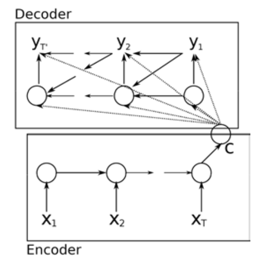

&emsp;오늘 방통대 딥러닝을 공부하던 내용을 정리해 보았다.   

---

#### 인코더-디코더 구조   
&emsp;seq2seq(sequence-to-sequence)라고도 불리며, 인코더는 시퀀스를 입력으로 받아 하나의 문맥 벡터(context vector)로 요약한다. 디코더는 문맥 벡터를 해석해서 출력 시퀀스를 만들어 낸다.   

#### 어텐션   
&emsp;모델이 상대적으로 더 중요한 부분에 주목하도록 만드는 방식으로, 인코더에서 나온 시점별 은닉 상태들의 가중 평균으로 문맥 벡터를 만들어 낸다. 어텐션을 적용한 인코더-디코더 모델은 상대적으로 더 긴 시퀀스를 잘 다룰 수 있으며, 어텐션 맵을 통해 모델이 어떤 부분을 주목하는지 시각화할 수가 있다.   

#### RNN
&emsp;RNN은 시퀀스를 다루기 위해 주로 사용되는 모델이며, 이미지 데이터는 주로 CNN을 사용하게 된다. 입력으로 들어오는 시퀀스의 길이가 학습 때 사용된 최대 시퀀스 길이보다 더 길어진다 하더라도 같은 파라미터들을 반복적으로 적용하여 모델의 출력을 계산해 낼 수 있다. 시퀀스 길이가 길어질수록 시퀀스 앞쪽의 정보가 소실되어 성능의 저하가 나타날 수 있다.   

#### RNN, LSTM, GRU   
&emsp;LSTM은 RNN보다 더 긴 시퀀스를 잘 다룰 수 있다. GRU는 LSTM의 단순화 버전이며, 매 시점마다 하나의 상태 벡터를 유지한다.   

#### 인코더-디코더 구조   
   
&emsp;인코더와 디코더에 RNN 계열의 모델이 사용되었다. 인코더 RNN의 마지막 은닉 상태가 입력된 문장의 내용을 요약하는 문맥 벡터 C가 된다. 여기서 어텐션 매커니즘은 사용되지 않았다.   

#### 이 코드에 from_logits=True 옵션을 준 이유
```python
loss = tf.losses.SparseCategoricalCrossentropy(from_logits=True)
```   
&emsp;원래대로라면 모델의 출력에서 나온 로짓값에 소프트맥스 함수를 적용해서 확률분포를 계산해야 하지만 소프트맥스 함수를 계산하는 데 드는 비용이 크기 때문에, 소프트맥스 함수의 적용 없이 로짓값을 가지고 바로 손실을 계산하기 위해 이와 같이 loss를 정의한 것이다.   

---

- **위치 인코딩(positional encoding)**: 토큰의 시퀀스 내 위치를 나타내는 값   
- **셀프 어텐션(self attention)**: 하나의 시퀀스 안에 있는 항목들 사이에서 일어나는 어텐션   
- **크로스 어텐션(cross attention)**: 인코더와 디코더 사이를 가로질러 일어나는 어텐션   
- **계층 정규화(layer normalization)**: 딥러닝 학습을 안정적으로 만들기 위한 정규화 방식의 일종   

#### 트랜스포머의 특징
&emsp;인코더-디코더 구조로 이루어져 있으며, 시퀀스 내에서의 위치 정보를 위치 인코딩을 통해 부여한다. 인코더-디코더 사이에서 이루어지는 크로스 어텐션을 제외하고도, 같은 시퀀스 내에서 일어나는 셀프 어텐션 메커니즘을 적용하였다.

#### 셀프 어텐션 메커니즘
&emsp;시퀀스에서 모델의 목적에 필요한 부분에 더 집중할 수 있으며, 시퀀스 내의 모든 단어 사이에 연결이 존재하기 때문에, 멀리 떨어진 단어들 사이의 의존 관계도 파악할 수 있고 결과적으로 RNN에 비해 긴 시퀀스를 다룰 수 있다. 계산을 병렬적으로 할 수 있기 때문에 RNN에 비해 더 짧은 시간에 많은 데이터를 학습할 수 있고, 이는 모델 성능의 향상으로 이어질 수 있다. 또한 여러 개의 어텐션 헤드를 적용하는 멀티 헤드 어텐션을 통하여 서로 다른 특징들을 추출해 낼 수가 있다.   

#### 디코더
&emsp;디코더 층을 N번 쌓음으로써 구성된다. 하나의 디코더 층은 Masked Multi-Head Attention, Add & Norm, Cross Attention 그리고 Feed Forward 층들을 이용해 구성된다.   

#### 트랜스포머   
&emsp;RNN과 같이 시퀀스 형태의 데이터를 다루기 위한 딥러닝 모델이다. 순차적으로 값을 계산해야 하는 RNN과 달리 병렬적인 계산이 가능하다. 여러 개의 어텐션 헤드를 사용함으로써 시퀀스의 서로 다른 특징들을 추출해 낼 수 있다. 트랜스포머의 어텐션 메커니즘은 인코더에서 사용된 셀프 어텐션, 디코더에서 사용된 인과 셀프 어텐션, 인코더와 디코더 사이에서 작용하는 크로스 어텐션 등이 있다.   

#### 인과 셀프 어텐션   
&emsp;인과 셀프 어텐션은 디코더 층에서 사용되며, 인코더 쪽의 출력은 입력으로 받지 않는다. 또한 현 시점보다 뒤쪽의 내용을 참조하지 못하게 하기 위해 마스킹을 사용한다.   

#### 번역을 위한 트랜스포머를 구현하기 위한 코드의 일부   
```python
class Transformer(tf.keras.Model):
    ...
    def call(self, inputs):
        context, x = inputs # 번역의 대상인 문장을 가리키는 변수
        context = self.encoder(context) # self.encoder가 리턴한 context는 인코더의 출력으로, 크로스 어텐션 부분에 사용될 디코더 입력으로 들어감
        x = self.decoder(x, context) # self.decoder의 입력으로 들어간 x는 번역 결과에 해당하는 문장이 shift된 시퀀스

        # Final linear layer output
        logits = self.final_layer(x)

        ...

        # Return the final output and the attention weights.
        return logits
```

---

&emsp;아직 솔직하게는 완벽하게 이해가 되지는 않았지만 이해가 될 때까지 수십번을 더 볼 것이다.(아마 수백 번 봐야할지도...😅)