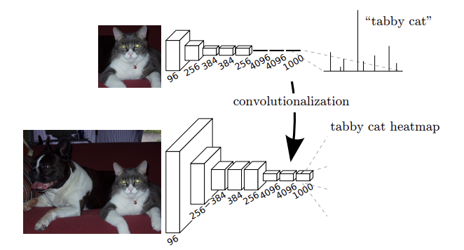

딥러닝 관련 논문 읽기 Part 1

---

# Fully Convolutional Networks for Semantic Segmentation   
&emsp;2015년에 Jonathan Long, Evan Shelhamer, Trevor Darrell 이 세 사람이 제안한 논문으로, 딥러닝을 활용한 시맨틱 세그멘테이션 분야에서 획기적인 성과를 이룬 모델이다. 이 논문은 전통적인 합성곱 신경망(CNN, Convolutional Neural Networks)을 세그멘테이션 작업에 맞게 확장하여, 이미지의 각 픽셀을 분류하는 "픽셀(pixel) 단위의" 의미적 레이블링을 가능하게 한다.   
## 1.기존 세그멘테이션 문제와 CNN의 한계   
&emsp;기존의 CNN 모델은 이미지 분류(classification)에 강점을 보였으나, 시멘틱 세그멘테이션을 위한 픽셀 단위 분류에는 적합하지 않았다. 일반적인 CNN은 이미지의 중요한 특징을 추출하고, 이를 통해 이미지 전체를 특정 클래스(예: 고양이, 자동차 등)로 분류한다. 하지만 시맨틱 세그멘테이션에서는 이미지의 각 픽셀에 개별적으로 레이블을 할당해야 하기 때문에, CNN의 구조만으로는 해결하기 어려웠다.   
&emsp;기존 방식은 보통 CNN의 최종 출력층에서 이미지를 '클래스 스코어 맵'으로 줄이기 때문에, 결과적으로 이미지의 위치 정보(픽셀 정보를 잃음)를 유지하는 것이 어렵다. 이를 해결하기 위해 기존 방식에서는 패치(patch)-기반 접근 방식을 활용해 왔지만, 이는 비효율적이었고, 계산 비용이 높다는 단점이 있었다.   
## 2. FCN의 주요 아이디어: 전이합성곱(Deconvolution)과 픽셀 단위 예측   
&emsp; FCN 모델의 핵심 기법은 다음과 같다.   
1. **완전한 컨볼루션 네트워크 설계**: 완전 연결층(Fully Connected Layer)을 제거하고, 모든 층을 컨볼루션 층으로 구성하여 입력 이미지의 크기에 상관없이 작동하게 만들었다. 즉, 이미지의 크기가 달라져도 모델이 자동으로 크기에 맞는 피쳐맵을 생성할 수 있게 된다.   
2. **업샘플링(Up-sampling)**: 이미지의 각 픽셀에 대응하는 레이블을 생성하기 위해 다운샘플링(down-sampling)된 피쳐맵을 업샘플링한다. 이를 통해 **전이 합성곱**(Transposed Convolution, Deconvolution)을 사용한다. 업샘플링 과정을 통해 입력 이미지와 동일한 크기의 피쳐맵을 생성하고, 각 픽셀에 대해 클래스 예측을 할 수 있게 한다.   
3. **스킵 연결(Skip Connection)**: 세그멘테이션에서는 높은 해상도와 더 깊은 추상화 레벨이 조화를 이룰 필요가 있다. 따라서, FCN에서는 고수준(깊은 레이어) 특징 맵과 저수준(얕은 레이어) 특징 맵을 결합하여 보다 정밀한 세그멘테이션 결과를 얻는다. 스킵 연결은 특정 레이어의 출력을 업샘플링된 피쳐맵과 결합하여 보다 정확한 경계 및 위치 정보를 복구할 수 있도록 도와준다.   
## 3. 네트워크 구조 및 아키텍처   
&emsp;FCN은 다양한 기존 모델(VGG16, AlexNet 등)의 기본 CNN 아키텍처를 기반으로 설계될 수 있으며, 이를 세그멘테이션 목적에 맞게 수정한 것이다.   
&emsp;구조는 다음과 같다.   
- 먼저 CNN을 통해 입력 이미지를 컨볼루션 및 풀링하여 저해상도 피쳐맵을 생성한다.   
- 이 저해상도 피쳐맵을 전이합성곱 층을 통해 점진적으로 업샘플링한다.   
- 업샘플링 과정 중 스킵 연결을 통해 고해상도 정보를 더해준다.   
- 최종적으로, 이미지 크기에 맞게 업샘플링된 피쳐맵을 바탕으로 각 픽셀의 클래스 확률을 계산하고, 시맨틱 레이블을 할당한다.   
## 4. 성능 및 결과   
&emsp;FCN은 PASCAL VOC 2011, PASCAL VOC 2012 등 다양한 세그멘테이션 벤치마크에서 이전 모델들보다 우수한 성능을 보였다. FCN의 성공은 이후 다양한 세그멘테이션 네트워크에 영감을 주었고, 이를 기반으로 하는 Deeplab, U-Net, Mask R-CNN 등 후속 연구들이 계속해서 개발되었다.   
## 5. FCN의 한계와 이후 연구 방향   
&emsp;FCN은 시맨틱 세그멘테이션의 기초를 다진 연구이지만, 한계도 존재한다.   
- 전이합성곱을 통한 단순한 업샘플링은 세밀한 경계 정보를 유지하는 데 어려움이 있다.   
- 객체와 배경의 경계에서 세부사항을 복원하는 데 한계가 있어, 이후 연구에서는 다중 스케일 피쳐와 주의 메커니즘(attention mechanism)을 추가한 방법이 등장했다.   
## 요약   
&emsp;FCN 논문은 CNN을 세그멘테이션 작업에 맞게 확장하여, 이미지의 각 픽셀을 분류하는 시멘틱 세그멘테이션의 가능성을 열었다. FCN의 전이합성곱 및 스킵 연결 아이디어는 이후 딥러닝 기반 세그멘테이션 모델의 발전에 중요한 기초를 제공하였다.   

**[그림 1]** 완전 컨볼루션 네트워크는 시맨틱 세그멘테이션과 같은 픽셀 단위의 작업을 효율적으로 학습하여 고밀도 예측을 수행할 수 있다.   

**[그림 2]** 완전 컨볼루션 네트워크를 일반 컨볼루션 레이어로 변환하면 분류망이 히트맵을 출력할 수 있다. 그럼 그림 1에서와 같이 레이어와 공간 손실을 추가하면 엔드 투 엔드 고밀도 학습을 위한 효율적인 맵을 생성할 수 있다.

---

오늘은 여기까지...