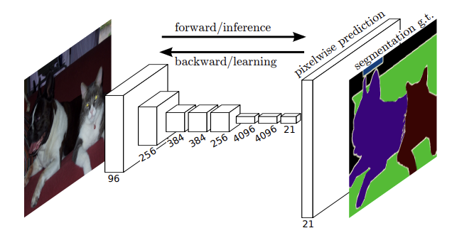

&emsp;아래 코드는 현재 팀프로젝트에서 작업하고 있는 채팅화면 코드이다.

---

```python
from dotenv import load_dotenv
import os
import openai
import streamlit as st
import copy
from datetime import datetime

# .env 파일에서 환경 변수 로드
load_dotenv()
OPENAI_API_KEY = os.getenv("OPENAI_API_KEY")

# OpenAI API 키 설정
openai.api_key = OPENAI_API_KEY

# 이미지 파일 경로
image_path = "img/image.png"

# Streamlit 애플리케이션 구성
def main():
    # Streamlit 설정
    st.set_page_config(
        page_title="JobGPT - AI 커리어 도우미",  # 브라우저 탭 제목 설정
        page_icon=image_path,  # 페이지 아이콘 설정
        layout="centered",  # 페이지 레이아웃 설정
        initial_sidebar_state="expanded"  # 사이드바 초기 상태 설정 (확장된 상태)
    )

    # 메인 화면 로고 이미지
    if os.path.exists(image_path):  # 이미지 파일이 존재하는지 확인
        st.image(image_path, use_column_width=False, caption="당신의 AI 커리어 도우미")  # 이미지 표시
    else:
        st.error("이미지 파일을 찾을 수 없습니다. '{}' 경로를 확인하세요.".format(image_path))  # 이미지가 없을 경우 오류 표시

    # 메인 화면 제목
    st.title("JobGPT에 오신 것을 환영합니다.")  # 타이틀 설정
    st.markdown("""
    JobGPT는 취업과 경력 개발을 지원하는 AI 기반 챗봇입니다.  
    아래 버튼을 클릭하여 질문을 입력해 보세요!
    """)  # 설명 텍스트

    # 초기 세션 상태 설정
    if "messages" not in st.session_state:  # 세션 상태에 messages가 없을 경우 초기화
        st.session_state["messages"] = []
    if "saved_sessions" not in st.session_state:  # 세션 상태에 saved_sessions가 없을 경우 초기화
        st.session_state["saved_sessions"] = []

    # 사이드바: 이전 채팅 세션을 불러오기 위한 인터페이스
    with st.sidebar:
        st.header("JobGPT 메뉴")

        # 이전 세션 불러오기
        saved_sessions = st.session_state["saved_sessions"]
        if saved_sessions:
            selected_session = st.selectbox("이전 채팅 세션 불러오기", options=list(range(len(saved_sessions))), format_func=lambda x: f"채팅 기록 {x + 1}")
            if st.button("선택된 세션 불러오기"):
                # 선택된 세션 불러오기
                st.session_state["messages"] = saved_sessions[selected_session]

        st.markdown("---")
        st.markdown("📩 **Contact us:** wriml92@knou.ac.kr")  # 연락 정보 표시

    # 사용자 입력 섹션
    user_input = st.text_input("메세지를 입력해 주십시오.", key="user_input")  # 사용자 메시지 입력란
    send_button = st.button("Send")  # 전송 버튼

    # 메시지 처리
    if send_button and user_input:
        # 사용자 메시지를 세션 상태에 추가
        st.session_state["messages"].append({"role": "user", "content": user_input})

        # OpenAI GPT-4o 모델에 메시지를 보내기
        bot_response = get_openai_response(user_input)

        # JobGPT 응답을 세션 상태에 추가
        st.session_state["messages"].append({"role": "assistant", "content": bot_response})

    # 현재 대화를 저장하기 위한 버튼
    if st.button("현재 대화 저장"):
        # 세션 저장
        st.session_state["saved_sessions"].append(copy.deepcopy(st.session_state["messages"]))
        st.success("현재 대화가 저장되었습니다!")

        # 대화 내용을 텍스트 파일로 저장
        save_chat_to_file(st.session_state["messages"])

    # 사용자와 JobGPT 메시지 스타일 (HTML 형식으로 메시지를 스타일링하여 출력)
    user_message = """
    <div style="
    background-color: #26a6f0;
    color: white;
    padding: 10px;
    border-radius: 10px;
    margin-bottom: 10px;
    display: flex;
    align-items: center;
    justify-content: flex-end;
    max-width: 60%;
    margin-left: auto;
    ">
        
        {message}
    </div>
    """
    assistant_message = """
    <div style="
    background-color: #f1f1f1;
    color: black;
    padding: 10px;
    border-radius: 10px;
    margin-bottom: 10px;
    display: flex;
    align-items: center;
    width: 60%;
    margin-right: auto;
    ">
        
        {message}
    </div>
    """

    # 채팅 인터페이스: 세션 상태에 저장된 메시지를 반복하여 출력
    for msg in st.session_state["messages"]:
        if msg["role"] == "user":
            st.markdown(user_message.format(message=msg["content"]), unsafe_allow_html=True)
        else:
            st.markdown(assistant_message.format(message=msg["content"]), unsafe_allow_html=True)

# OpenAI GPT-4o API를 호출하여 사용자의 질문에 대한 응답을 생성하는 함수
def get_openai_response(user_input):
    try:
        messages = [{"role": "system", "content": "You are a helpful assistant specialized in job searching and career advice."}]
        messages += st.session_state["messages"]

        # OpenAI API 호출
        response = openai.ChatCompletion.create(
            model="gpt-4o",  # GPT-4o 모델 사용
            messages=messages,  # 메시지들 전달
            max_tokens=300,  # 응답의 최대 토큰 수 설정
            temperature=0.7  # 응답의 다양성 조절
        )
        return response["choices"][0]["message"]["content"].strip()  # 응답 내용 반환
    except openai.error.OpenAIError as e:
        return f"OpenAI API에서 오류가 발생했습니다: {str(e)}"
    except Exception as e:
        return "오류가 발생했습니다. 인터넷 연결을 확인하고 다시 시도해 주세요."

# 대화 내용을 파일로 저장하는 함수
def save_chat_to_file(messages):
    try:
        # 파일명에 저장 시간을 추가하여 고유하게 만듦
        timestamp = datetime.now().strftime("%Y%m%d_%H%M%S")
        filename = f"chat_history_{timestamp}.txt"

        # 메시지들을 파일에 저장
        with open(filename, "w", encoding="utf-8") as file:
            for msg in messages:
                role = "User" if msg["role"] == "user" else "Assistant"
                content = msg["content"]
                file.write(f"{role}: {content}\n")

        st.success(f"채팅 내용이 {filename}에 저장되었습니다.")
    except Exception as e:
        st.error(f"채팅 내용을 저장하는 중 오류가 발생했습니다: {str(e)}")

# Streamlit 앱 실행
if __name__ == "__main__":
    main()

```

---

## 주요 부분 설명
1. **환경 설정 및 API 키 로드**:
- `dotenv`를 이용해 `.env` 파일에서 OpenAI API 키를 로드하고, `openai.api_key`에 설정한다.

2. **Streamlit 설정 및 레이아웃**:
- `st.set_page_config()`로 페이지의 레이아웃, 아이콘, 제목 등을 설정한다.

3. **이미지 및 메인 화면 구성**:
- 이미지 파일이 존재하면 `st.image()`로 화면에 표시한다. 메인 타이틀과 설명 텍스트도 설정한다.

4. **세션 상태 관리**:
- `st.session_state`를 이용해 이전 메시지와 저장된 세션을 관리한다.

5. **사이드바 구현**:
- 이전에 저장된 대화 세션을 불러올 수 있도록 사이드바에서 옵션을 제공한다.

6. **메시지 입력 및 처리**:
- 사용자의 메시지를 입력 받고, 버튼 클릭 시 이를 저장하고 OpenAI API로 보내서 응답을 받는다.

7. **대화 저장 기능**:
- 버튼 클릭으로 현재 대화 내용을 저장할 수 있다. 텍스트 파일로도 저장한다.

8. **HTML을 사용한 채팅 인터페이스**:
- 사용자와 봇의 메시지를 HTML과 CSS로 스타일링하여 사용자 친화적인 UI를 제공한다.

9. **OpenAI API 호출 함수**:
- 사용자의 메시지와 이전 메시지들을 GPT-4 모델로 보내고 응답을 받아온다.

10. **대화 내용을 파일로 저장**:
- 현재 대화 내용을 파일로 저장하는 기능이 포함되어 있다. 파일명에 타임스탬프를 추가하여 고유하게 만든다.